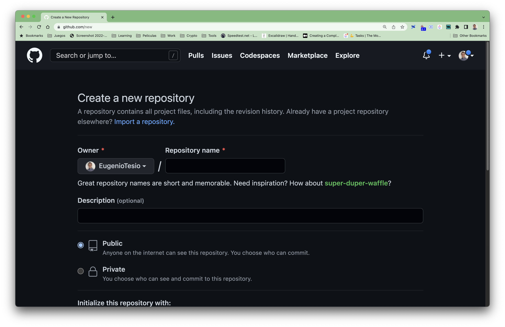
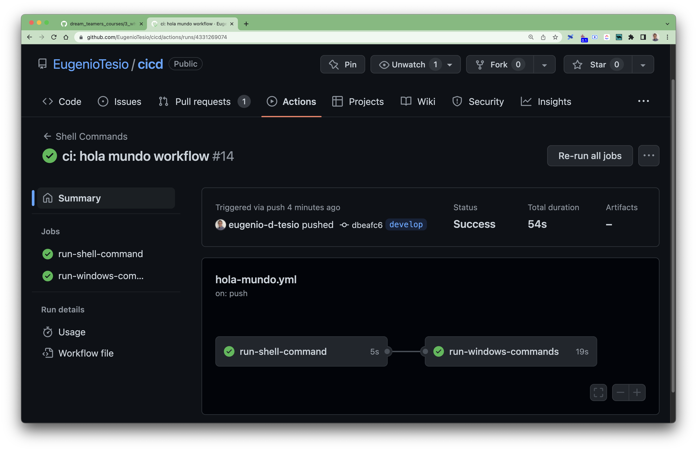
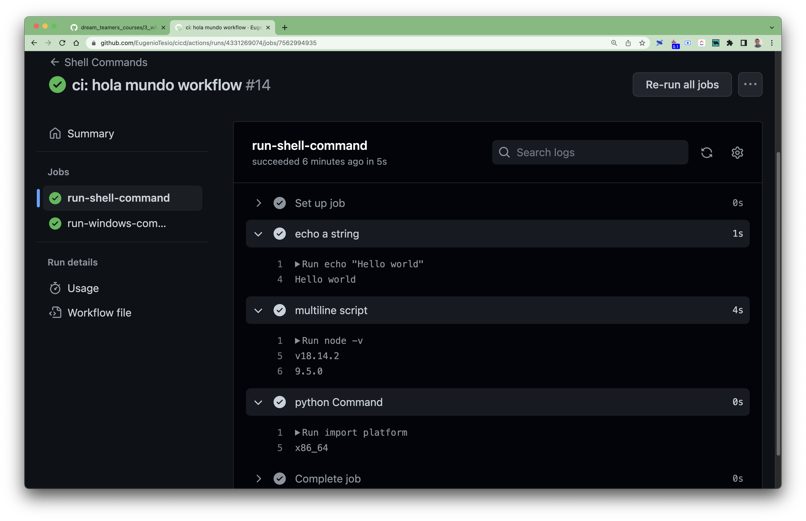
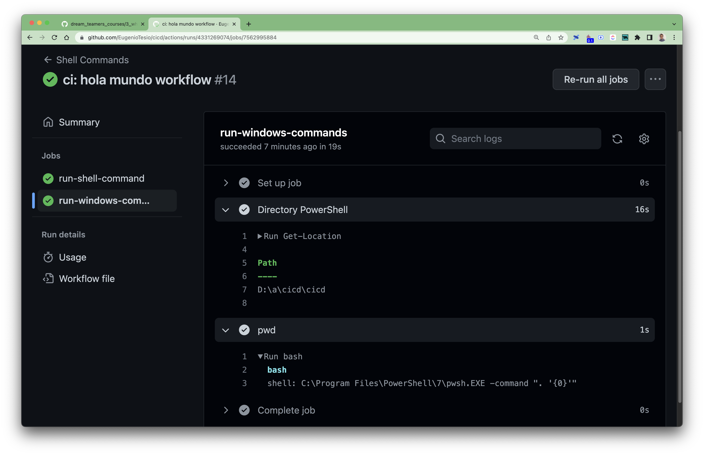

# GitHub Actions Hello World

@Eugenio Tesio

## Tool overview

Before we start writing our first Action let's take a look at what GitHub Actions offers us to develop our continuous integration process.

GitHub Action uses the internal events of the GitHub repository to trigger the __workflows__ we create. Some of these events can be:

- Push
- Pull request:
  - open
  - merge
  - close
- Issue:
  - created
  - closed
- Scheduled (e.g. every 24 hs)
- External events

This way we could think, for example, of sending a Slack message to our development team every time a user creates an Issue in our repository, or create a ticket in our Project Management tool (assuming it has the necessary API's for this operation).

## :computer: Workflows

Workflows are a series of jobs that are executed after an event occurs, e.g. after a push. Workflows are structured in __YAML__ files inside a special subdirectory (where GitHub Actions will read them) which by default is `.github`.

There can be more than one __YAML__ file inside the folder, indicating that there are more than one workflow, which can even be triggered by the same event. This allows us to organize our workflows in an organized way with a good division of responsibilities between them.

Within the Workflows, there are different __Jobs,__ which in turn have __Steps,__.

## :runner: Runners

At this point you may be wondering, "that's all very nice... but how does it work on the inside, what makes it possible to execute the Workflows Jobs? The answer is Runners. These are virtual machines with Linux, MacOS or Windows that are created when they receive an event and that internally have installed a software called GitHub Action runner, which allows us to run our Jobs. The runners also have installed a software stack commonly used for development:

- curl, npm, git, yarn, pip.
- python, ruby, nodeJS.
- AndroidSDK y Xcode.

## :hammer: Let's get to work

The time has come. Enough abstract text, let's start creating our first Workflow and learn with examples.

We will start by creating the repository in our GitHub account (create an account if you don't have one), for which we can access https://github.com/new. In my case I will call the repository __cicd__.



After creating the repository on GitHub, let's initialize it in our local, replacing the source with the URL of your repository.

```bash
echo "# cicd" >> README.md
git init
git add README.md
git commit -m "first commit"
git branch -M main
git remote add origin https://github.com/EugenioTesio/cicd.git
git push -u origin main
```

Before we start working with the __YAML__ file I recommend installing the extension in VSCode which will detect that the file is a GitHub Action and will facilitate code autocompletion, which makes our lives easier.

    Name: YAML
    Id: redhat.vscode-yaml
    Description: YAML Language Support by Red Hat, with built-in Kubernetes syntax support
    Version: 1.10.1
    Publisher: Red Hat
    VS Marketplace Link: https://marketplace.visualstudio.com/items?itemName=redhat.vscode-yaml

We will start by creating the first __Workflow__, which we will call `hello_world.yml`.

```bash
mkdir .github
cd .github
mkdir workflows
cd workflows
nano hello_world.yml
```

and in it we will write the following lines of code.

```yml
name: Shell Commands # Workflow name.

on: [
  push # Action on which the workflow is to be executed.
]

jobs:
  run-shell-command: # Name of the first job in the workflow.
    runs-on: ubuntu-latest # Virtual machine on which it will be executed.
    steps:
      - name: echo a string # Name of the first step.
        run: echo "Hello world" # Command that will execute the first step.
      - name: multiline script # Name of the second step.
        run: | # Operator to execute multiple commands.
          node -v
          npm -v
      - name: python Command # Third step.
        run: |
          import platform
          print(platform.processor())
        shell: python # Console to use.
  run-windows-commands: # Name of second job.
    runs-on: windows-latest # It will use a Windows virtual machine.
    needs: [
      'run-shell-command' # Requires run-shell-command to be installed
    ]
    steps:
      - name: Directory PowerShell
        run: Get-Location
      - name: pwd
        run: bash
```

Then, after saving the changes, we will `commit` and `push` the changes.

```bash
git add .
git commit -m"ci: hola mundo workflow"
git push origin main
```

In the Actions tab in our GitHub project we will see the results of the jobs and their output.



__NOTE:__ You can see how the jobs have been executed one after the other. By default, when jobs are declared, they are executed in sequential order.

If we click inside each __Job__ we will see the outputs of each one.





In the third step of the __run-shell-commands__ job you can see a special `shell` tag, which is instructing GitHub Actions to run the command on another console, in this case __Python__. The same result could be obtained if you create a `hello_world.py` file containing the lines:

```python
import platform
print(platform.processor())
```

and running:

```bash
python hellow_wolrd.py
```

There are many __shells__ available depending on the operating system being used, these are detailed in the [documentation](https://docs.github.com/en/actions/using-workflows/workflow-syntax-for-github-actions#using-a-specific-shell) on GitHub.