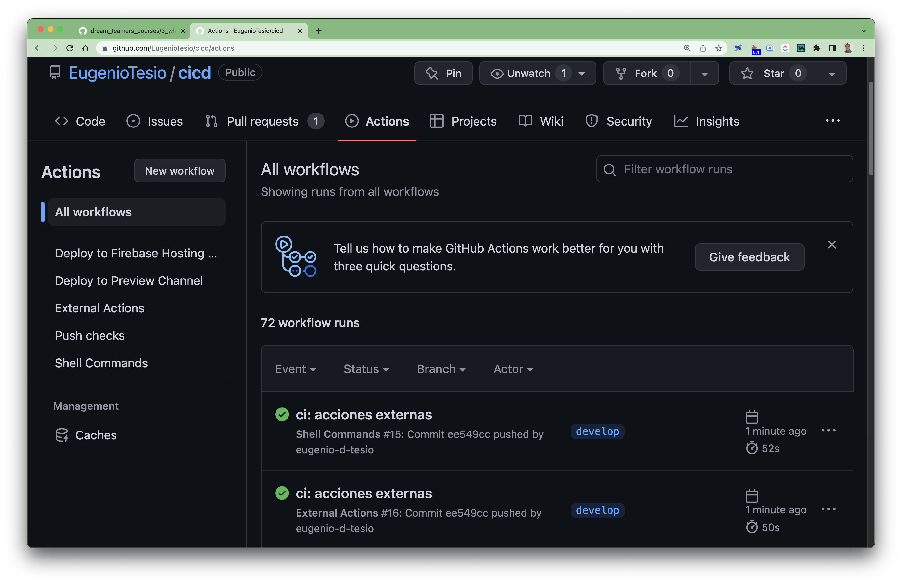
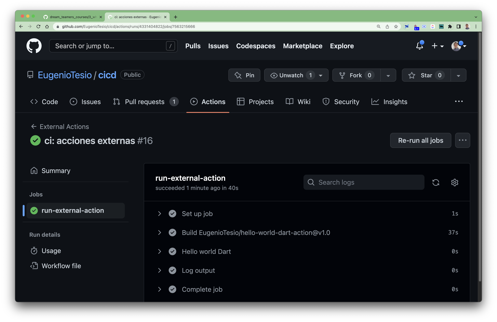

# External Actions

@Eugenio Tesio

Just as we can create our own jobs, it is also possible to use actions from other developers hosted on _GitHub_, which makes the integration work much easier. Next we are going to create a new __Workflow__ by invoking an external action and passing parameters to it.

## Hello world with external action

We will use this [external action](https://github.com/EugenioTesio/hello-world-dart-action) that we have created for the purpose of this course, which is a good example for those who are interested in creating an action. We can see that it is actually a _hello world_ written in __Dart__ that accepts a `who-to-greet` input parameter and we can capture a `time` output result.

We will begin by creating a new __Workflow__ file which we will call `external_actions.yml`. To do this, we go to the root of the already created project and execute the following lines of code:

```bash
cd .github/workflows
nano acciones_externas.yml
```

Then we copy the __snippet__ lines of code, which we will explain below.

```yml
name: External Actions # Workflow name.

on: [push] # It will be executed when you push any branch.

jobs:
  run-external-action: # Name of first job.
    runs-on: ubuntu-latest # Virtual machine on which it runs.
    steps:
      - name: Hello world Dart # Name of the first step.
        id: hw # Unique identifier that will be used later to obtain the results.
        uses: EugenioTesio/hello-world-dart-action@v1.0 # External action to use. The name of the action is conformed by deleting http://github.com/ to the repository url.
        with:
          who-to-greet: Mauro # Value assignment to the required variable.
      - name: Log output # Step for printing the output of the previous step.
        run: echo ${{ steps.hw.outputs.time }}
```

Regarding the external action, in this case we use the `v1.0` tag since it is indicated in the documentation, but it is not the only option, we can also use:

- _Branch name:_ `EugenioTesio/hello-world-dart-action@main`.
- _The hash of a specific commit:_  `EugenioTesio/hello-world-dart-action@45a902258783cf077787f4652051fb531a2e6a1b`.

Finally we will commit and push.

```bash
git add .
git commit -m "ci: acciones externas"
git push origin main
```

The outcome of the Workflow is shown in the following image:





When we open the step __Hello world Dart__ we can see that "Hello Mauro" was printed in the console and in the step __Log output__ the date of the variable `time`.
