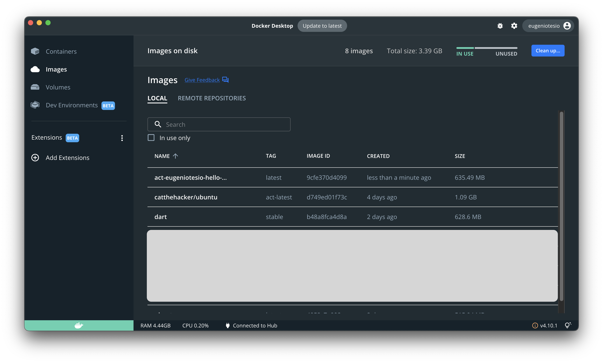

# Running actions on localhost

@Eugenio Tesio

The first problem we will encounter when we start writing our own GitHub Action is that it is very tedious to make push, pull requests, etc; to test that our action works correctly, not to mention how bad and messy the history of our repository gets; something that, being professionals, we should take care of.

## Installing and testing the tool

The tool to perform the tests locally is [act](https://github.com/nektos/act/). To install the tool it is necessary to have [Docker Desktop](https://docs.docker.com/desktop/) installed. To install it you only need to run:

- MacOS (you must have [Homebrew](https://brew.sh/)) installed

    ```bash
    brew install act
    ```

- Windows (you must have [Chocolatey](https://docs.chocolatey.org/en-us/choco/setup) installed)

    ```bash
    choco install act-cli
    ```

Once installed, we will test if it works correctly. Execute the following command in the root of our project to list the available Workflows:

```bash
act -l
```

Which in our cicd project should yield the following output:

```
Stage  Job ID                Job name              Workflow name     Workflow file                 Events
0      run-external-action   run-external-action   External Actions  acciones_externas.yml         push  
0      checks                checks                Push checks       all-branches-push-checks.yml  push  
0      run-shell-command     run-shell-command     Shell Commands    hola_mundo.yml                push  
1      run-windows-commands  run-windows-commands  Shell Commands    hola_mundo.yml                push
```

This proves that the tool is working properly.

## Running the program

With the following command line we will execute the action `run-external-action`:

```bash
act -j run-external-action
```

For Apple's M1 chipset or higher, the following must be added `--container-architecture linux/arm64`:

```bash
act -j run-external-action --container-architecture linux/arm64
```

The console's output will be:

```bash
[External Actions/run-external-action] 🚀  Start image=catthehacker/ubuntu:act-latest
[External Actions/run-external-action]   🐳  docker pull image=catthehacker/ubuntu:act-latest platform=linux/arm64 username= forcePull=false
[External Actions/run-external-action]   🐳  docker create image=catthehacker/ubuntu:act-latest platform=linux/arm64 entrypoint=["tail" "-f" "/dev/null"] cmd=[]
[External Actions/run-external-action]   🐳  docker run image=catthehacker/ubuntu:act-latest platform=linux/arm64 entrypoint=["tail" "-f" "/dev/null"] cmd=[]
[External Actions/run-external-action]   ☁  git clone 'https://github.com/EugenioTesio/hello-world-dart-action' # ref=v1.0
[External Actions/run-external-action] ⭐ Run Main Hello world Dart
[External Actions/run-external-action]   🐳  docker pull image=act-eugeniotesio-hello-world-dart-action-v1-0-dockeraction:latest platform=linux/arm64 username= forcePull=false
[External Actions/run-external-action]   🐳  docker create image=act-eugeniotesio-hello-world-dart-action-v1-0-dockeraction:latest platform=linux/arm64 entrypoint=[] cmd=["Mauro"]
[External Actions/run-external-action]   🐳  docker run image=act-eugeniotesio-hello-world-dart-action-v1-0-dockeraction:latest platform=linux/arm64 entrypoint=[] cmd=["Mauro"]
| Hello Mauro
| 
[External Actions/run-external-action]   ⚙  ::set-output:: time=2023-01-26 11:37:27.509529
[External Actions/run-external-action]   ✅  Success - Main Hello world Dart
[External Actions/run-external-action] ⭐ Run Main Log output
[External Actions/run-external-action]   🐳  docker exec cmd=[bash --noprofile --norc -e -o pipefail /var/run/act/workflow/1] user= workdir=
| 2023-01-26 11:37:27.509529
[External Actions/run-external-action]   ✅  Success - Main Log output
[External Actions/run-external-action] 🏁  Job succeeded
```

You can see how act creates 2 images:

- catthehacker/ubuntu.
- act-eugeniotesio-hello-world-dart-action-v1-0-dockeraction.

The first one is the __act__ tool itself and the second one is the image of our project. If you open Docker Desktop, in the Images tab, you will see 3 images created, the 2 previous ones and one more of __Dart__ that is created by the action `EugenioTesio/hello-world-dart-action@v1`


