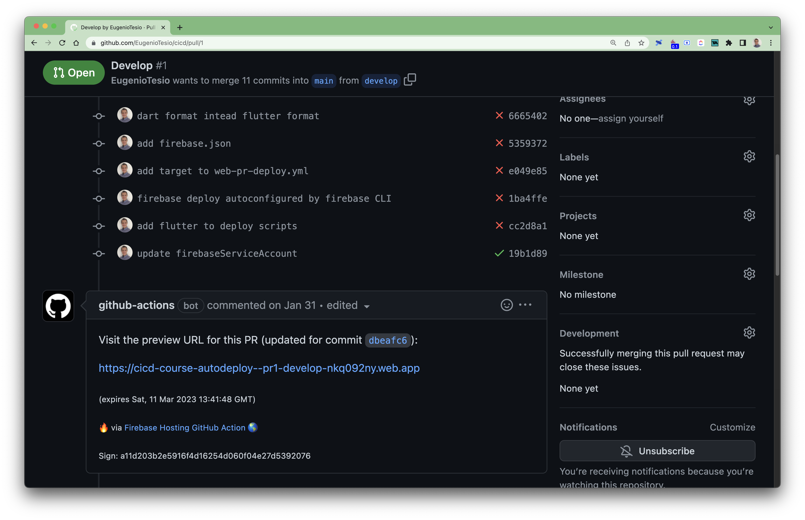

# Bonus track

@Eugenio Tesio

In this section we want to leave you a very important action that will help you in your current projects. It is to build a preview of the project for each `pull request` action. This is a very good practice because we will have the evidence of how the application works with the introduced changes.

When deploying the website we will use the [FirebaseExtended/action-hosting-deploy](https://github.com/FirebaseExtended/action-hosting-deploy) action that Firebase Hosting uses to host our website free of charge. Then we will start by creating a new project on the platform.

## Creation of the Firebase project

1. Go to [https://console.firebase.google.com](https://console.firebase.google.com/).
2. If you do not have a user, please register.
3. Click on `Create a project`. In case you already have a project, click on `Add Project`.
4. We place the name of the project, in my case I will use __cicd-course-autodeploy__, but as the name must be unique, when you place this name below it will suggest a variant ending with numbers and random characters, e.g.: __cicd-course-autodeploy-6hgt6__.
5. Check the checkboxes for Terms and Conditions, etc.
6. Click continue to go to step 2/3.
7. Disable the Firebase Analytics options. If necessary we will activate them later and continue.

At this point we will have already created our project for the autodeploy of our `pull request`.

## Autodeploy generation

With the [Firebase CLI](https://firebase.google.com/docs/cli) tool we will be able to achieve our goal of deploying our preview web site on the `pull request` action and on the `merge` action with the main branch.

### Firebase CLI installation and configuration

To install the tool according to the platform, follow these steps:

#### Windows

1. Download the installer from [here](https://firebase.tools/bin/win/instant/latest).
2. Open the file and follow the installation steps.

#### MacOS / Linux

1. Download the binary for [MacOS](https://firebase.tools/bin/macos/latest) or [Linux](https://firebase.tools/bin/linux/latest).
2. Create a folder in the home `.firebase_tools` and copy the file there renaming it to `firebase`.

    ```cmd
    mkdir $HOME/.firebase_tools
    cp firebase-tools-macos $HOME/.firebase_tools/firebase
    ```

3. Edit the file `~/.bash_profile, ~/.bashrc or profile` or `.~/.zshrc or .zprofile`, depending if we have _Bash Shell_ or _Z Shell_ and add the path to `PATH` to be able to run the binary from anywhere. If when opening the file the `PATH` variable is defined like this:

    ```cmd
    PATH="$PATH"
    ```

   we must replace it with:

    ```cmd
    PATH="$PATH:$HOME/.firebase_tools"
    ```

4. We update the system variables by executing:

    ```cmd
    source ~/.bashrc
    source ~/.zshrc
    ```

5. We check that it has been updated:

    ```cmd
    echo $PATH
    ```

    we should see that the `PATH` includes `$HOME/.firebase_tools`

Once the installation of the tool is finished, we will execute the next step, which will open a tab in our browser by default so that we do not authenticate with our Google account (the same one used to create the Firebase project):

```cmd
firebase login
```

To verify that everything is OK, we can run

```cmd
firebase projects:list
```

which will show us the list of projects, in which should be `cicd-course-autodeploy`:

```cmd
✔ Preparing the list of your Firebase projects
┌────────────────────────┬────────────────────────┬────────────────┬──────────────────────┐
│ Project Display Name   │ Project ID             │ Project Number │ Resource Location ID │
├────────────────────────┼────────────────────────┼────────────────┼──────────────────────┤
│ cicd-course-autodeploy │ cicd-course-autodeploy │ 198022861637   │ [Not specified]      │
└────────────────────────┴────────────────────────┴────────────────┴──────────────────────┘

1 project(s) total.
```

## Autodeploy script generation

We will begin by starting Firebase Hosting from the CLI, which will ask us questions to generate the project configuration.

```cmd
firebase init hosting
```

The questions and what to answer are listed below:


- `What do you want to use as your public directory? (public) build/web` which is the folder where our html code will be generated when we run `flutter build web`.
- `Configure as a single-page app (rewrite all urls to /index.html)? (y/N) y`
- `Set up automatic builds and deploys with GitHub? (y/N) y`
- `File build/web/index.html already exists. Overwrite? (y/N) N`


Then it will open a tab in the web browser to log in to GitHub, so the tool will be able to access the repositories on our behalf.

- `For which GitHub repository would you like to set up a GitHub workflow? (format: user/repository) EugenioTesio/cicd`. It is the relative path of the repository URL, which in my case is [https://github.com/EugenioTesio/cicd](https://github.com/EugenioTesio/cicd).
- `Set up the workflow to run a build script before every deploy? (y/N) y`
- `What script should be run before every deploy? (npm ci && npm run build)` We hit enter here, as we will then manually modify the file to include the external actions that allow us to build our code.
- `Set up automatic deployment to your site's live channel when a PR is merged? (Y/n) y`
- `What is the name of the GitHub branch associated with your site's live channel? (main)` in my case the main branch is main, so I press enter.

When all is finished, the tool will have done the following:

- Added the `firebase.json` file in the root of the project that contains the instructions to deploy the project.
- Created `firebase-hosting-merge.yml` workflow that will be executed only when we do a push to the main branch.
- Created the workflow `firebase-hosting-pull-request.yml` in the same directory which will be executed for all the pushes we do.
- Generated the service account in Google Cloud Platform and assigned the necessary permissions. To view it you can access [GCP Service Accounts page](https://console.cloud.google.com/iam-admin/serviceaccounts)
- Added the `FIREBASE_SERVICE_ACCOUNT_CICD_COURSE_AUTODEPLOY` secret in GitHub.

It is important to know that Firebase was completely integrated to GCP, although its user interface was maintained, so the issue of service accounts and permissions is handled from GCP. For the creation of the service account we will follow the next steps.

## Adapt the workflow to Flutter

By looking at both workflows generated by the tool, we see that the step of building the web application is `- run: npm ci && npm run build` which is incorrect and we must replace it with the code that builds the web application in Flutter, therefore in the `firebase-hosting-merge.yml` file it would look like this:

```yml
name: Deploy to Firebase Hosting on merge
'on':
  push:
    branches:
      - main
jobs:
  build_and_deploy:
    runs-on: ubuntu-latest
    steps:
      - uses: actions/checkout@v2
      - uses: subosito/flutter-action@v2
        with:
          channel: stable
      # Web application building steps for Flutter
      - run: flutter pub get
      - run: flutter build web
      - uses: FirebaseExtended/action-hosting-deploy@v0
        with:
          repoToken: '${{ secrets.GITHUB_TOKEN }}'
          firebaseServiceAccount: '${{ secrets.FIREBASE_SERVICE_ACCOUNT_CICD_COURSE_AUTODEPLOY }}'
          channelId: live
          projectId: cicd-course-autodeploy
```

and the `firebase-hosting-pull-request.yml` file like this:

```yml
name: Deploy to Firebase Hosting on PR
'on': pull_request
jobs:
  build_and_preview:
    if: '${{ github.event.pull_request.head.repo.full_name == github.repository }}'
    runs-on: ubuntu-latest
    steps:
      - uses: actions/checkout@v2
      - uses: subosito/flutter-action@v2
        with:
          channel: stable
      # Web application building steps for Flutter
      - run: flutter pub get
      - run: flutter build web
      - uses: FirebaseExtended/action-hosting-deploy@v0
        with:
          repoToken: '${{ secrets.GITHUB_TOKEN }}'
          firebaseServiceAccount: '${{ secrets.FIREBASE_SERVICE_ACCOUNT_CICD_COURSE_AUTODEPLOY }}'
          projectId: cicd-course-autodeploy
```

Once the changes have been made, we will push them to a new branch:

```cmd
git checkout develop
git add .
git commit -m"despliegue automático"
git push origin develop
```

Finally, we will go to the GitHub repository and create a pull request from the `develop` branch to the `main` branch. Once the PR is created we will be able to see in the Action tab how our workflow is running. At the end of the workflow, we can see inside the created PR that the `github-actions` bot added a message with the url of the preview of our project.



We believe it is very important to be able to have a preview of our work, it facilitates many bug detections or even UI adjustments before the merge with the main branch and of course there is also the advantage of saving time of the work team.
